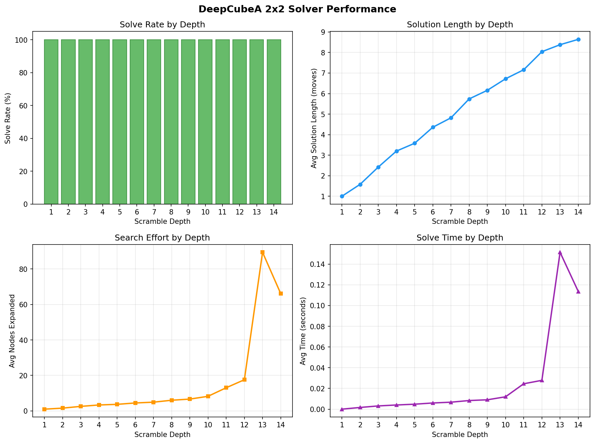

# DeepCubeA 2x2 Solver

Solving the 2x2 Rubik's cube with deep RL, based on the DeepCubeA paper (Agostinelli et al., 2019).

Trains a neural network to estimate how many moves any state is from solved, then uses that as a heuristic for A* search.

## How it works

The 2x2 cube has about 3.67 million reachable states and God's number is 14 (quarter turn metric).

**Training (Autodidactic Iteration):**

The idea is to train backwards from the solved state. You scramble a bunch of cubes, then for each scrambled state, look at all its neighbors (states reachable in one move) and ask the network "how far are these from solved?". The target is `1 + min(neighbor values)`. Solved states get target 0.

To keep things stable, there's a frozen "target network" that generates the targets. The actual network being trained is separate. You only copy the trained weights into the target network once the loss drops below a threshold. This prevents the feedback loop where bad predictions make bad targets which make worse predictions (which absolutely does happen without it -- ask me how I know).

**Solving:**

Once trained, the value network is used as a heuristic for weighted A* search.

## Architecture

ResNet with residual blocks, based on the architecture from the actual DeepCubeA repo:

```
input (24 sticker values) -> one-hot (144d) -> FC 2048 -> FC 512 -> 4 res blocks -> output (1 value)
```

~3.5M parameters.

## Results

After training for ~7 minutes on an M4 MacBook Pro (200 update cycles, 50K states each):



**100% solve rate at all depths 1-14** (God's number). 1400 total solves, zero failures.

| Depth | Solve Rate | Avg Moves | Avg Nodes | Avg Time |
|-------|-----------|-----------|-----------|----------|
| 1     | 100%      | 1.0       | 1         | <1ms     |
| 7     | 100%      | 4.8       | 5         | 7ms      |
| 10    | 100%      | 6.7       | 8         | 12ms     |
| 14    | 100%      | 8.6       | 66        | 114ms    |

The solver is near-optimal -- most solutions are close to the shortest possible. Search is efficient too, usually expanding fewer than 100 nodes even at max depth.

## Usage

```
pip install -r requirements.txt

# train (~7 min on Apple Silicon)
python train.py --num_updates 200 --states_per_update 50000 --epochs_per_update 3 --back_max 30

# resume if you stopped it
python train.py --resume

# solve some scrambles
python solve.py --model_path checkpoints/latest.pt --scramble_depth 10

# run the full benchmark
python benchmark.py --model_path checkpoints/latest.pt
```

## Files

- `cube_env.py` - 2x2 cube environment, moves, state representation
- `model.py` - ResNet value network
- `train.py` - training loop with target network
- `solve.py` - A* solver
- `benchmark.py` - performance benchmark + graph generation

## References

Agostinelli et al., "Solving the Rubik's Cube with Deep Reinforcement Learning and Search", Nature Machine Intelligence, 2019.

## License

GPLv3
